  

Building (and breaking) stuff.

Backend, distributed systems, and cloud.

## Tech stack

   

            

     

    

  

## Projects

| Project | What it is | Stack |
| :-- | :-- | :-- |
| **Flux** | Message broker with fanout, direct and topic exchanges, at-least-once delivery and backpressure. Moved to a single-threaded epoll loop: ~20× throughput (93K msgs/s), p99 down to 67 µs. | C++20, epoll, TCP |
| **RedDB** | Redis-inspired database server speaking RESP. GET/SET/DEL, TTL expiry, Pub/Sub, AOF persistence, race-detector verified. | Go, TCP, Concurrency |
| **Emty** | Privacy-first desktop email app. Mail stays local in SQLite, picks and configures a local Ollama model automatically, ranks emails by interest. | TypeScript, Tauri, Express, MongoDB, SQLite |

## Experience

- **CometChat**, Software Developer (2026): ticket allocation engine for 100+ users, Claude-powered evaluation harness that surfaced 30+ logic gaps, deployed on AWS behind an ALB.
- **ApplyCup**, Backend Developer (2025–26): sandboxed code execution with isolate, Redis/BullMQ worker architecture (2× throughput), chunked video pipeline with FFmpeg and Firebase.
- **Valueye**, Backend Engineering Intern (2025): LLM context pipelines over live market data, ~40% lower query latency, Chroma vector search.

